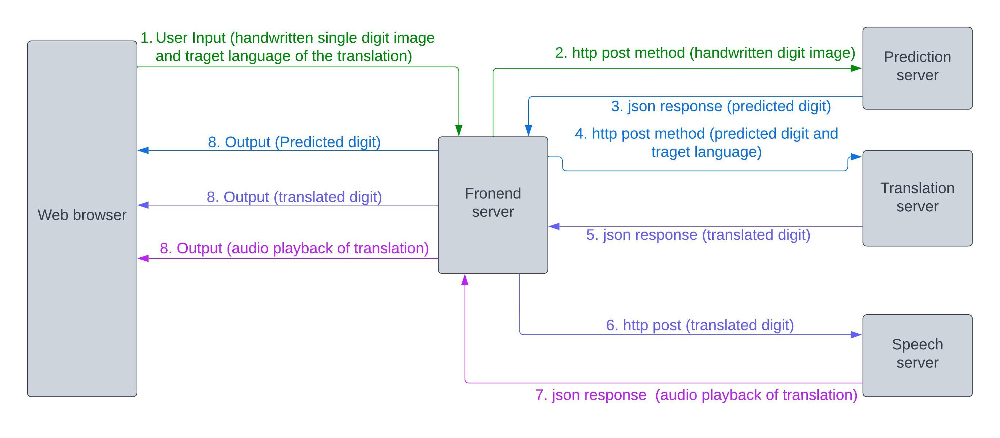
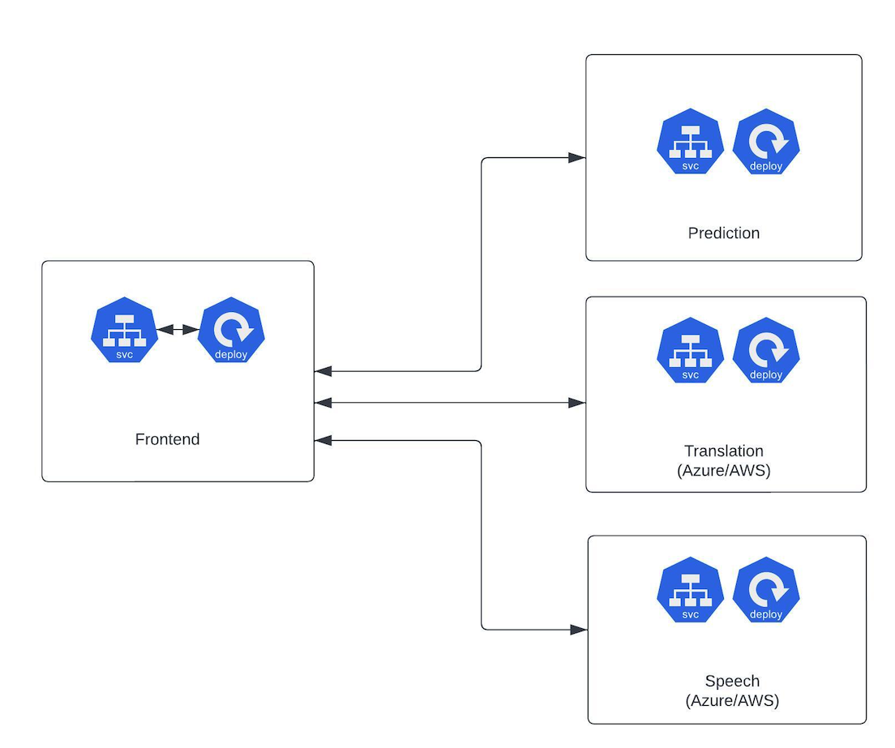

# Description

The application allows users to upload a handwritten single-digit image,
which is then processed by a prediction server. The predicted digit is
translated into a user-defined target language and converted to speech
using other servers. The resulting audio is sent back to the user\'s
browser for playback. Finally, the user can get the predicted digit in
the translated language with audio playback in the web browser.

# Architecture

The high-level architecture diagram of this application is as follows:



Microservice architecture:

 

# Prerequisites:

1.  Docker is installed in the machine. The installation procedure can be found here: (https://docs.docker.com/engine/install/)
2.  Minikube installed in the machine. The installation procedure can be found here: (https://minikube.sigs.k8s.io/docs/start/)
3.  Azure translate and speech service resources are created in Azure Cloud Or AWS user with programmatic access with appropriate permission to use the translate and Polly services.
4.  All the deployments and services need to be deployed sequentially as mentioned.


## Step 1: Building docker images:

To build docker images:

run the command from the directory ```Speech/Azure/``` :

``` docker build -t speech-azure-app . ```

run the  command from the directory ```Speech/AWS/``` :

``` docker build -t speech-aws-app . ```

run the  command from the directory ```Translation/aws/``` :

``` docker build -t translate-aws-app . ```

run the  command from the directory ```Translation/azure/``` :

``` docker build -t translate-azure-app . ```

run the  command from the directory ```CNN-model/``` :

``` docker build -t cnn-app . ```

run the commands from the directory ```Frontend/``` :

``` docker build -t frontend-app . ```

``` docker images ```

## Step 2: Loading docker images to the local repository of Minikube:

To load the images to the local image repository of Minikube run the
following commands:

Note: It may take some time to load the "cnn-app" image to the local image
repository of Minikube since the image is bigger in size.

``` minikube cache add speech-azure-app:latest ```

``` minikube cache add speech-aws-app:latest ```

``` minikube cache add translate-aws-app:latest ```

``` minikube cache add translate-azure-app:latest ```

``` minikube cache add cnn-app:latest ```

``` minikube cache add frontend-app:latest ```

``` minikube image ls --format table ```


## Step 3: Deploying the applications as a microservices:

To create the deployments and services, follow the steps sequentially:

Run all the commands from the directory ``` YAML-Deployments-&-Services/ ```

### 1. Deploy cnn-app deployment snd service:

``` kubectl apply -f cnn-app-deployment.yaml ```

``` kubectl apply -f cnn-app-svc.yaml ```


### 2. Deploy translation-app deployment and service:

For translation, we can choose any of the deployment. We can choose
either translation for azure or translation for AWS.

- Translation in Azure:

Identify the following lines from the file
```translation-app-azure-deployment.yaml``` and replace the ```value``` with the
Azure translation service key, endpoint, and location.

```vi translation-app-azure-deployment.yaml```
```
 env:
  - name: "KEY"
    value: "<replace with your azure translation service key>"
  - name: "ENDPOINT"
    value: "<replace with your azure translation service endpoint>"
  - name: "LOCATION"
    value: "<replace with your azure translation service location>"
```

```kubectl apply -f translation-app-azure-deployment.yaml```

```kubectl apply -f translation-app-azure-svc.yaml```

- Translation in Azure:

Identify the following lines from the file
```translate-app-aws-deployment.yaml``` and replace the ```value``` with your AWS
access key, secret access key, and default region.

```vi translate-app-aws-deployment.yaml```
```
 env:
  - name: "AWS_ACCESS_KEY_ID"
    value: "<replace with your aws access key>"
  - name: "AWS_SECRET_ACCESS_KEY"
    value: "<replace with your aws secret access key>"
  - name: "AWS_DEFAULT_REGION"
    value: "<replace with your aws default region>"
```

```kubectl apply -f translate-app-aws-deployment.yaml```

```kubectl apply -f translate-app-aws-svc.yaml```


### 3. Deploy speech-app deployment and service:

For speech-app, we can choose any of the deployment. We can use either
speech for azure or speech for AWS.

- Speech in Azure:

Identify the following lines from the file
```speech-app-azure-deployment.yaml``` and replace the ```value``` with your Azure
speech service key and location.

```vi speech-app-azure-deployment.yaml```
```
 env:
  - name: "SPEECH_KEY"
    value: "<replace with your azure speech service for speech key>"
  - name: "SPEECH_LOCATION"
    value: "<replace with your azure speech service for speech location>"
```
- Speech in AWS:

Identify the following lines from the file
```speech-app-aws-deployment.yaml``` and replace the ```value``` with your AWS
access key, secret access key, and default region.

```vi speech-app-aws-deployment.yaml```
```
env:
 - name: "AWS_ACCESS_KEY_ID"
   value: "<replace with your aws access key>"
 - name: "AWS_SECRET_ACCESS_KEY"
   value: "<Replace with your aws secret access key>"
 - name: "AWS_DEFAULT_REGION"
   value: "<replace with your aws default region>"
```

```kubectl apply -f speech-app-aws-deployment.yaml```

```kubectl apply -f speech-app-aws-svc.yaml```

### 4. Deploy frontend-app deployment and service:

Identify the following lines from the file ```frontend-app-deployment.yaml```
and replace them with the appropriate ```IP address```.

For the translation and speech, we can either use AWS service or Azure
service. If we want to use AWS service for example, then we have to
replace the environment variables ```value``` of ```TRANSLATION``` and ```TTS``` with the
appropriate ```IP``` and ```port``` of ```translate-app-aws``` and ```speech-app-aws service```.

```vi frontend-app-deployment.yaml```
```
env:
-  name: "PREDICTION"
   value: http://<replace with the cluster IP of the svc cnn-app>:5000/predict
-  name: "TRANSLATION"
   value: http://<replace with the cluster IP of the svc translation-app-azure>:5002/translate
-  name: "TTS"
   value: http://<replace with the cluster IP of the svc speech-app-azure>:5005/tts
```

To get the ```cluster IP``` and ```port``` of the services, run the command:

```kubectl get svc```

```kubectl apply -f frontend-app-deployment.yaml```

```kubectl apply -f frontend-app-svc.yaml```

## Step 4: Browse the application

Identify the node name where the ```frontend-app-xxxxxxxx``` pod is deployed.

Run the command: ```kubectl get nodes -o wide```

Identify the internal IP address of the node where the
```frontend-app-xxxxxxxx``` pod is deployed.

Run the command: ```kubectl get pods -o wide```

Visit the url from the browser:

```http://<Replace with the internal IP address of the node>:30364```

The sample handwritten digit images are located under the directory
```Test-images/```


